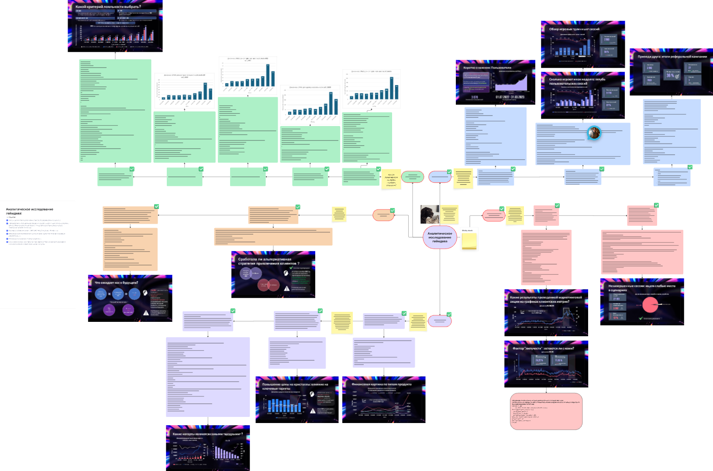

# Zombie Revolution — аналитика поведения игроков (SQL-проект)

>## Описание проекта
>
>Проект направлен на исследование поведения пользователей в мобильной игре Zombie Revolution. 
>Анализ охватывает пользовательскую активность, монетизацию, маркетинговые кампании, инциденты и реферальную систему.
>
>**Период анализа:** Июль 2022 — Апрель 2023  
>**Цель:** Выявить факторы роста, удержания и выручки на основе SQL-анализа данных  
>**Используемый стек:** PostgreSQL · VS Code · Excel · PowerPoint · Miro · GitHub

##  Содержание проекта

| Файл | Описание |
|------|----------|
| `01_user_base_analysis.sql` | Анализ регистраций, повторных регистраций, динамики пользовательской базы |
| `02_sessions_analysis.sql` | Поведение в сессиях, средняя длительность, вовлечённость |
| `03_referral_analysis.sql` | Реферальная система, эффективность, K-factor |
| `04_marketing_incidents.sql` | Эффективность акции, DAU, WAU, MAU, SFW, SFM и проблемы с iOS-сессиями |
| `05_monetization.sql` | Доходность, анализ кристаллов, когортный анализ, LTV |
| `06_hypotheses.sql` | Проверка продуктовых и финансовых гипотез |
| `07_loyalty_analysis.sql` | Определение лояльности и построение LMAU по разным критериям |

---

##  Основные метрики и выводы

###  Пользователи:
- Уникальных пользователей: **3078**
- Рост регистраций начинается с января 2023 года

###  Сессии:
- 65–70% сессий в 2023 году длятся более 5 минут
- Увеличение длительности сессий указывает на рост вовлечённости

### Монетизация:
- Основной доход приносят категории **currency**, **ammo**, **materials**
- Повышение цен на кристаллы не увеличило выручку — игроки стали покупать меньше

### Маркетинг:
- Кампания марта 2023 увеличила MAU, но не обеспечила удержание
- Инциденты: 97% незавершённых сессий приходятся на iOS

### Рефералка:
- K-factor = **0.93** → игра не распространяется вирусно
- Средняя следующая когорта прогнозируется на **318 игроков** (историческое среднее — 343)

### Лояльность:
- Разработаны 5 критериев лояльности, рассчитан LMAU
- Топ-100 пользователей приносят наибольшую выручку в среднем за месяц жизни

---

##  Визуализации и презентация

-  [Презентация проекта (PDF)](https://github.com/Gulyserver/sql-game-analytics/blob/442d0ef8ee1b90ca056c52d4c2c70140dd7bd00f/presentation/Zombie%20revolution.pdf))
-  [Схема проекта в Miro](https://miro.com/app/board/uXjVINthjXI=/?share_link_id=418067126671)
  

---

##  Рекомендации

1. Оптимизировать реферальную программу для повышения K-factor
2. Сфокусироваться на новых когортах — они дают лучший LTV
3. Исправить технические ошибки на iOS (end_session)
4. Повторно протестировать изменение цены кристаллов (A/B)
5. Углубить работу с лояльными сегментами на основе LMAU

---

